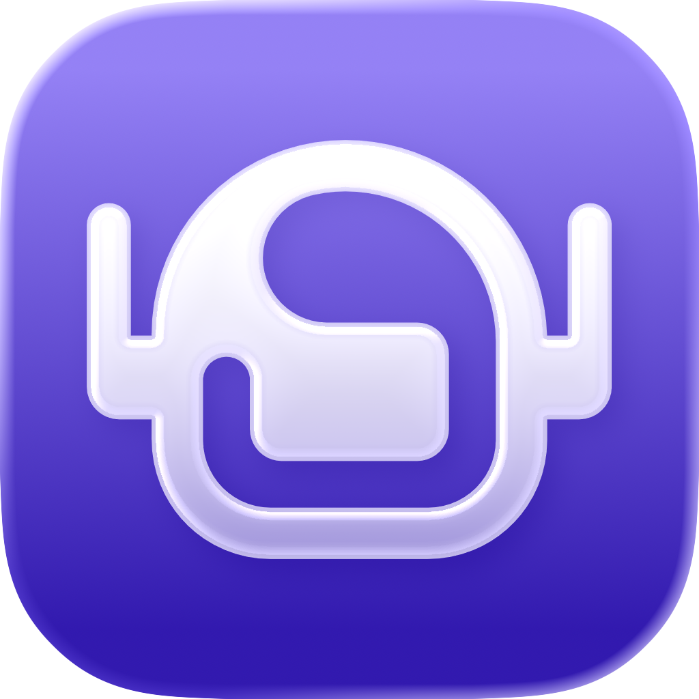

<p align="center">
  
  <h1 align="center">SuperAgent - AI Agent Platform</h1>
</p>

SuperAgent is a super app for building and running personal agents. You can create custom agents, let them develop the skills they need to do task for you, and have them run automatocally in the background for you.

**Features:**

- **Containerized Agents** - SuperAgents spins up a containerized sandbox per agent - keeping your computer secure. 
- **Connected Accounts** - easily connect 100s of accounts your agent can use.
- **Secure Integrations** - API calls are proxied outside your agent and the agent never sees Auth Tokens, keeping your account secure and giving you an audit trail of agent actions.
- **Recurring and Scheduled Tasks** - agents can schedule recurring tasks and future work so they can serve you autonomously in the backhround.
- **Beowser Access** - agents can spin up and use a web browser to accomplish tasks where no API / MCP is available.
- **Agent Dashboards & Artifacts** - agents can create dashboard for you to more easily access information.
- **Create Shared Skillsets** - as agents create skills for your work - creaate skillsets to share them with your team!

**Run as:**

- **Web App** - you can run super agent in server mode and access it via the web. Great if you have a computer that can run it 24/7
- **Desktop App** - you can download and run superagent locally in your machine as a desktop app.

## Pre-Reqs

To get strated with Superagent, you need:

1. **A container runtime** -> this is where SuperAgent will run it’s agent containers. Our recommendations:
  1. [Docker Desktop](https://docs.docker.com/desktop/setup/install/mac-install/)
  2. [OrbStack](https://orbstack.dev/download)
  3. [Podman](https://podman.io/get-started)
2. **An Anthropic API Key** -> we currently only support Anthropic models, more coming soon. Get your API key from the [Anthropic Console](https://platform.claude.com/settings/keys).
3. **[Optional] A Composio API key** -> SuperAgent uses Composio to generate OAuth Tokens for you for different acocunts. You can get one on [Composio](https://platform.composio.dev).


# Getting Started

## Desktop App
Download the latest release of the App here (MacOC only, Linux and Windows coming soon).

[[Insert Download Links for Latest Stable Release]]

## Running with Docker

You can run Superagent in a Docker container using Docker-outside-of-Docker (DooD) to spawn agent containers.

### Using the published image

```bash
# Set your API key
export ANTHROPIC_API_KEY=your-api-key-here

# Pull and run
docker compose up

# Access at http://localhost:47891
```

### Building locally

```bash
# Build and run from source
docker compose up --build
```

### How it works

The Docker setup:
- Mounts the Docker socket for spawning sibling agent containers
- Persists data in `~/.superagent` (same path on host and container)
- Mounts `./agent-container` for building agent images on-demand

The image is published to `ghcr.io/iddogino/superagent` on every push to main and on version tags.

## Running from Source

1. Install dependencies:
   ```bash
   npm install
   ```

2. Build the agent container:
   ```bash
   npm run build:container
   ```

3. Set up environment variables (see below)

4. Run database migrations:
   ```bash
   npm run db:migrate
   ```

5. Start the development server:
   ```bash
   npm run dev
   ```

## Environment Variables

| Variable | Description | Default |
|----------|-------------|---------|
| `ANTHROPIC_API_KEY` | Your Anthropic API key (required) | - |
| `SUMMARIZER_MODEL` | Model used for generating session names | `claude-haiku-4-5` |
| `CONTAINER_STATUS_SYNC_INTERVAL_SECONDS` | How often to sync container status with Docker (seconds) | `300` |
| `RUNNER_AVAILABILITY_CACHE_TTL_SECONDS` | How long to cache Docker/Podman availability checks (seconds) | `60` |

Create a `.env.local` file in the project root:

```bash
ANTHROPIC_API_KEY=your-api-key-here
# Optional overrides
# SUMMARIZER_MODEL=claude-haiku-4-5
# CONTAINER_STATUS_SYNC_INTERVAL_SECONDS=300
# RUNNER_AVAILABILITY_CACHE_TTL_SECONDS=60
```

[[Finish this section -- get to a running server]]

# Development

## Scripts

### Development
| Script | Description |
|--------|-------------|
| `npm run dev` | Start web app + API server in parallel |
| `npm run dev:api` | Start API server only (port 3001) |
| `npm run dev:web` | Start Vite dev server only (port 3000) |
| `npm run dev:electron` | Start Electron app in development |

### Build
| Script | Description |
|--------|-------------|
| `npm run build` | Build web app + API for production |
| `npm run build:web` | Build web frontend only |
| `npm run build:api` | Build API server only |
| `npm run build:electron` | Build Electron app |
| `npm run build:container` | Build the agent Docker container |

### Distribution
| Script | Description |
|--------|-------------|
| `npm run dist:mac` | Package Electron app for macOS |
| `npm run dist:win` | Package Electron app for Windows |
| `npm run preview` | Build and run production server locally |

### Quality
| Script | Description |
|--------|-------------|
| `npm run typecheck` | Run TypeScript type checking |
| `npm run lint` | Run ESLint |
| `npm test` | Run tests in watch mode |
| `npm run test:run` | Run tests once |
| `npm run test:coverage` | Run tests with coverage |

### Database
| Script | Description |
|--------|-------------|
| `npm run db:migrate` | Run database migrations |
| `npm run db:generate` | Generate new migration |
| `npm run db:studio` | Open Drizzle Studio |
| `npm run db:reset` | Reset database |

## Architecture

The application uses a dual-target architecture supporting both web and Electron desktop deployment:

### Web Mode
- **Frontend**: Vite dev server (port 3000) proxies API requests to the backend
- **Backend**: Hono server (port 3001) handles API routes and serves static files in production

### Electron Mode
- **Main Process**: Starts embedded Hono API server and creates browser window
- **Renderer Process**: Same React app as web, communicates with API via localhost
- **Preload Script**: Exposes safe IPC methods to renderer

### Agent Containers
Each agent runs in its own Docker/Podman container with Claude Code in headless mode:
- Containers communicate via HTTP/WebSocket APIs
- SSE streaming for real-time message updates
- File-based persistence for agents, sessions, and messages
- SQLite database for OAuth connected accounts
