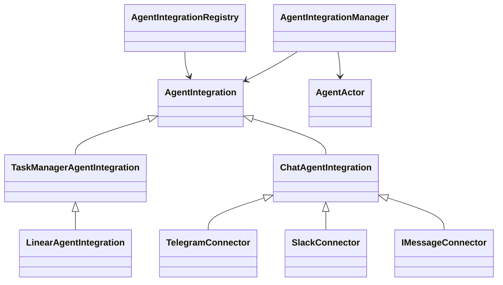

# Agent integrations

`AgentIntegration` is the application-facing runtime contract. One instance represents one installed identity for one agent. `AgentIntegrationManager` owns startup, shutdown, resume/reconnect, queues, actor sessions, and output subscriptions. Providers are constructed by `AgentIntegrationRegistry`; application callers do not cast them to a family or transport class.

## Contracts

| Contract | Owner and purpose |
| --- | --- |
| `connect`, `disconnect`, `isConnected`, `onEvent`, `onError` | Provider lifecycle and normalized input/response/hint events. The manager subscribes before connecting. |
| `resolveRoute` | Family chooses the stable external session key before the manager serializes work. The triggering interaction and reply target are separate fields. This hook performs no I/O. |
| `authorize`, `isAllowed` | Family supplies access policy. The manager enforces it before preparation/runtime work and rechecks it before sends and output delivery. |
| `sessionPolicy` | Family supplies timeout, session name, and metadata. The manager resolves the persisted mapping and operates through `AgentActor`. |
| `prepareInput`, `consumeInput` | Family builds context/attachments and can consume an interaction, such as a typed answer to an open question, without starting another turn. |
| `deliver` | Host emits runtime events, messages, typed `request-opened` / `request-resolved` outputs, and lifecycle notifications. `turn-completed` and `turn-failed` are terminal signals; a runtime `stream_end` remains a segment boundary. |
| `observeSession`, `releaseSession` | Passive family observation of manager-supplied activity and cleanup of delivery state. The manager owns the actor subscription; chat owns its indicator timers. |
| `getTools` | Family exposes optional tools through named, schema-described operations. Existing chat send/directory endpoints invoke these without accessing transport methods. |
| `onCreated` | Optional setup-only hook. iMessage uses it for the contact card; boot and reconnect never invoke it. |

The registry exposes serializable definitions (family, agent capabilities, management capabilities, setup fields, settings) before an installation is connected. Target classification can also be requested through the registry without constructing a connector. Each provider registers connection-independent `isAllowed` and `sessionPolicy` hooks; outbound session recording uses these against the current persisted installation even during a reconnect. Chat adapters and their registry entries share the same policy implementation.

## Chat behavior

`ChatAgentIntegration` owns `/clear`, Telegram's `/start`, sender attribution, input preparation, session naming, streaming delivery, working indicators, user-request cards, and chat tools. `chat-input.ts` contains the attachment download/upload and transcription path; `chat-delivery.ts` contains response formatting and streaming state. The concrete providers retain their protocol, threading, formatting, reaction, directory, and native-card implementations.

The normalized response event carries a request ID, request kind, and value. Chat-specific callback strings and question-answer envelopes are decoded in the chat family. The host retains actor-bound review submission, input claims, and stale-response checks. `emitEvent` awaits its subscribers: the host queues inputs and processes responses inline. The host logs and reports event-processing failures without changing connection status; connector errors still update status and notify the user. All chat events use `onEvent`.

## Runtime recovery and authorization loss

Families declare unfinished local work with `sessionsToRecover()`. The manager attaches host delivery before reconnecting the container stream, so terminal replay reaches the family even when no new external event arrives. Restoring unfinished sessions happens outside the integration-connect critical path; completed historical mappings do not start containers. Retries belong to those recovery demands and are cancelled when the integration or session is released.

The manager binds `IntegrationHost` before connection. Its `session(externalId)` reconciles a mapped stream and returns a session context with live read-only `activity` and `pendingRequests`. Unknown activity is not idle. Families use this narrow interface during dispatch/recovery; `observeSession` does not start containers or subscribe to runtime streams. The manager normalizes request notifications and uses the session wire for session-scoped requests, retaining the global wire only for agent-scoped review cards.

Inbound transports and outbound MCP credentials use `requireIntegrationReconnect` when authorization is definitively lost. The provider supplies its validated replacement config and the exact stored revision it invalidated. The shared transition clears credentials and saves disconnected status atomically, preserves pause, and ignores stale failures. The manager tears down its live connector and refreshes the agent's integration MCP projection. Transient transport errors remain recoverable; they cannot overwrite this terminal status.

## Persistence and compatibility

`agent-integration-service.ts` and `agent-integration-session-service.ts` own persistence. `store.ts` adapts their storage-facing records to neutral installation/session records; the physical `chat_integrations` and `chat_integration_sessions` tables and the `externalChatId` API field remain compatible. Existing IDs, credentials, approvals, timeout/model overrides, mappings, and transcripts stay in place. Chat reads its existing settings columns and keeps its existing session metadata flags.

The Slack provider factory supplies an installation-scoped store for joined-thread participation. `SlackConnector` saves its bounded thread list in `slack_thread_state` and restores it before accepting events, including when multiple threads share one agent session. The automatic migration preserves existing session rows; no integration reinstall is required.

Application startup, desktop resume, and API lifecycle calls use the same `agentIntegrationManager` singleton. Callers import the manager directly from `agent-integrations`; chat transports and fixtures use `ChatAgentIntegration` from the chat family. Existing chat HTTP paths and UI setup flows remain compatible. Discovery uses `list_agent_integrations`; historical tool calls retain their renderers.

## Integration-owned MCP

Providers may register `mcp(record)` to return an `IntegrationMcpConnection` without
constructing a live inbound connector. The integration owns credentials, refresh
and lifecycle; its `authorization()` callback must revalidate ownership and parent
state when called, including after asynchronous refresh. The shared MCP proxy
owns transport and audits. Its existing `remoteMcpId` records
`integration:<installation-id>` and `policyDecision` records `integration_identity`,
so attribution requires no additional audit column or migration.

Runtime projections expose these connections to every session of the owning agent
without creating a user-owned MCP account, assignment or independent
permission/delete control. Connect, pause and deletion refresh the running agent's MCP
environment. Pause claims lifecycle ownership before awaiting storage, and status
writes are serialized so an older resume or error cannot reopen a paused identity.
The provider reports authentication and availability changes through
its callbacks. Prompts explain the agent's identity and direct reconnection to the
parent integration. The host assigns installation-ID-based tool namespaces; the
container reserves those names against user MCPs. Only upstream network/protocol
failures affect outbound health, excluding caller cancellation and parent lifecycle
rejections. Ordinary requests authorize once; a real upstream handshake is followed
by a second check before forwarding the waiting tool call. Existing chat
providers do not opt in and retain their current outbound behavior.

## Management and discovery

`/api/agent-integrations` owns management for every provider; `/api/chat-integrations`
remains a compatibility URL. Persistence lives in `agent-integration-service.ts`
while the existing physical table names preserve installed accounts and sessions.
Provider definitions control safe serialization, management permission, settings,
cleanup, and reset-table ownership. Renderer providers register setup and optional
connection/settings panels; shared pages do not import concrete provider panels.

`list_agent_integrations` calls the agent-authenticated `/api/x-agent/integrations/list`.
It lists every account owned by the caller, its capabilities, active external session
IDs, and any integration-owned MCP identity/server/tools. Chat operations consume
chat capabilities; MCP providers use their named server. Credentials are excluded.

## Provider setup

Provider-level setup hooks run before a connector exists: `prepare`, optional
`testCredentials`, `authorize`, and `callback`. Generic HTTP routes authorize the
caller using the provider definition and delegate credential exchange/validation.
Create uses `POST /api/agent-integrations/agents/:id` with `{ provider, name, config }`;
authorization uses `POST /api/agent-integrations/:integrationId/authorize`. Provider
callbacks use `/api/agent-integrations/providers/:provider/callback`; the shorter
`/:provider/callback` path remains valid for previously registered callback URLs.
Callbacks require provider-validated, expiring one-use state instead of user cookies.

Telegram token validation, Slack bot/app-token checks, and iMessage code exchange
implement this same contract. Agent-side creation uses the same preparation hooks
and requires explicit provider opt-in, preserving owner-only interactive setup.
Initial authorization-required rows are inserted disconnected atomically.

Provider setup uses `IntegrationSetupLayout` for the shared header, instructions,
credential panel, fields, feedback and actions. Providers supply their content and
connection flow. An optional read-only `setup.describe` hook supplies app-creation
and callback URLs through the agent-scoped setup endpoint without creating an
installation. The endpoint enforces the same provider management role as creation.

## Task managers

`TaskManagerAgentIntegration` owns durable inbound work, one session per work item,
ordering, context hydration and run/request lifecycle. Linear implements the provider
setup, cleanup and MCP hooks; its UI panels register at the renderer composition point.
See [Linear integration](linear-agent-integration.md) for event delivery and identity setup.
