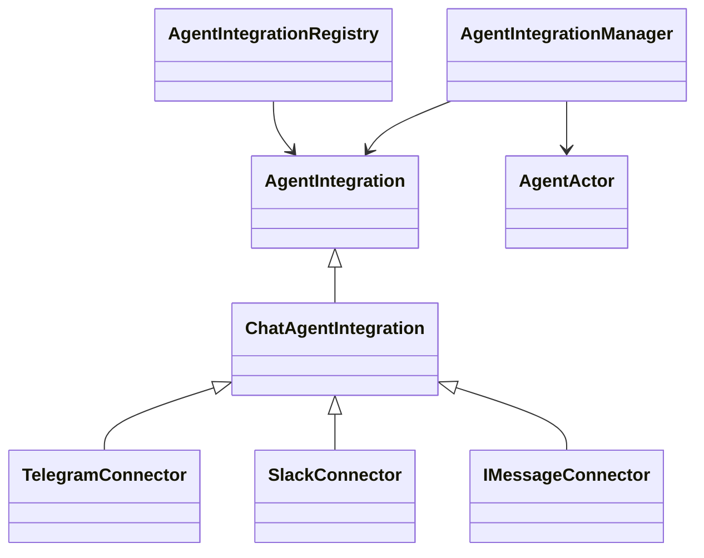

# Agent integrations

`AgentIntegration` is the application-facing runtime contract. One instance represents one installed identity for one agent. `AgentIntegrationManager` owns startup, shutdown, resume/reconnect, queues, actor sessions, and output subscriptions. Providers are constructed by `AgentIntegrationRegistry`; application callers do not cast them to a family or transport class.

## Contracts

| Contract | Owner and purpose |
| --- | --- |
| `connect`, `disconnect`, `isConnected`, `onEvent`, `onError` | Provider lifecycle and normalized input/response/hint events. The manager subscribes before connecting. |
| `resolveRoute` | Family chooses the stable external session key before the manager serializes work. The triggering interaction and reply target are separate fields. This hook performs no I/O. |
| `authorize`, `isAllowed` | Family supplies access policy. The manager enforces it before preparation/runtime work and rechecks it before sends and output delivery. |
| `sessionPolicy` | Family supplies timeout, session name, and metadata. The manager resolves the persisted mapping and operates through `AgentActor`. |
| `prepareInput`, `consumeInput` | Family builds context/attachments and can consume an interaction, such as a typed answer to an open question, without starting another turn. |
| `deliver` | Host emits runtime events, messages, requests, and lifecycle notifications. `turn-completed` and `turn-failed` are terminal signals; a runtime `stream_end` remains a segment boundary. |
| `observeSession`, `releaseSession` | Family can observe actor activity and clean up its delivery state. The manager owns the actor subscription; chat owns its indicator timers. |
| `getTools` | Family exposes optional tools through named, schema-described operations. Existing chat send/directory endpoints invoke these without accessing transport methods. |
| `onCreated` | Optional setup-only hook. iMessage uses it for the contact card; boot and reconnect never invoke it. |

The registry exposes serializable definitions (family, capabilities, setup fields, settings) before an installation is connected. Target classification can also be requested through the registry without constructing a connector. Each provider registers connection-independent `isAllowed` and `sessionPolicy` hooks; outbound session recording uses these against the current persisted installation even during a reconnect. Chat adapters and their registry entries share the same policy implementation.

## Chat behavior

`ChatAgentIntegration` owns `/clear`, Telegram's `/start`, sender attribution, input preparation, session naming, streaming delivery, working indicators, user-request cards, and chat tools. `chat-input.ts` contains the attachment download/upload and transcription path; `chat-delivery.ts` contains response formatting and streaming state. The concrete providers retain their protocol, threading, formatting, reaction, directory, and native-card implementations.

The normalized response event carries a request ID, request kind, and value. Chat-specific callback strings and question-answer envelopes are decoded in the chat family. The host retains actor-bound review submission, input claims, and stale-response checks. `emitEvent` awaits its subscribers: the host queues inputs and processes responses inline. The host logs and reports event-processing failures without changing connection status; connector errors still update status and notify the user. All chat events use `onEvent`.

## Persistence and compatibility

`store.ts` adapts the existing `chat_integrations` and `chat_integration_sessions` services to neutral installation/session records. Existing IDs, credentials, approvals, timeout/model overrides, mappings, and transcripts stay in place. Chat reads its existing settings columns and keeps its existing session metadata flags.

The Slack provider factory supplies an installation-scoped store for joined-thread participation. `SlackConnector` saves its bounded thread list in `slack_thread_state` and restores it before accepting events, including when multiple threads share one agent session. The automatic migration preserves existing session rows; no integration reinstall is required.

Application startup, desktop resume, and API lifecycle calls use the same `agentIntegrationManager` singleton. The old manager and `ChatClientConnector` import paths re-export compatibility aliases; they do not create another runtime. Existing chat HTTP paths, tool names, and UI setup flows remain compatible.

## Next phase

SUP-832 will add `TaskManagerAgentIntegration` and Linear's identity/setup, event transport, issue context, tools, and final-comment policy. They are intentionally absent from this refactor. The provider-neutral tests use a small test adapter with no chat methods to exercise routing, completion delivery, access enforcement, installation isolation, and teardown through the common host.
