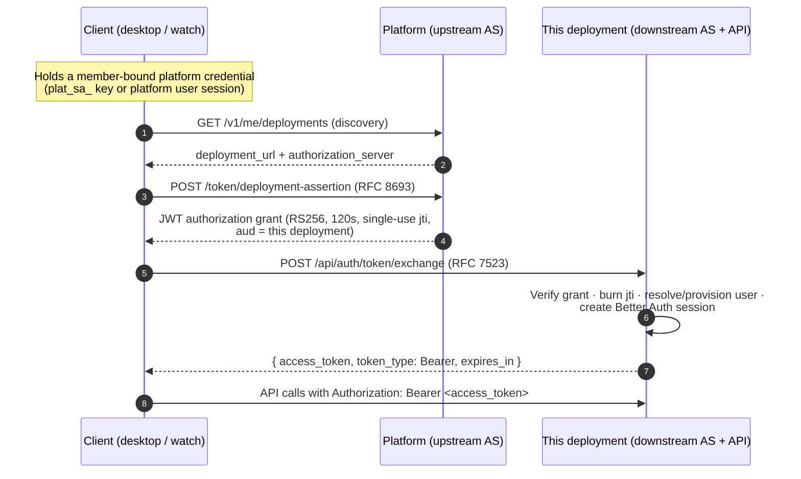

# Cross-client auth: bearer tokens + RFC 7523 token exchange

How non-browser clients (desktop app, iOS/watch companions) obtain and use
user-scoped access tokens for an **auth-mode (cloud) deployment** of this app,
without an interactive login round-trip.

This is the deployment-side half of the mechanism. The platform-side half
(RFC 8693 grant issuance + deployment discovery) is documented in the platform
repo at `docs/cross-client-auth.md`.

## Mechanism overview

The design follows the OAuth *identity and authorization chaining* pattern:
[RFC 8693](https://www.rfc-editor.org/rfc/rfc8693.html) token exchange at the
upstream Authorization Server (the platform), followed by an
[RFC 7523](https://www.rfc-editor.org/rfc/rfc7523.html) JWT bearer grant at the
downstream Authorization Server (this deployment).



Key properties:

- The deployment is the **sole authority for its own tokens**. The platform
  never receives or mints a deployment token; it only signs a short-lived
  grant that this deployment chooses to honor.
- Re-auth is silent: on any 401 the client repeats the two hops. Grants are
  cheap and single-use; the long-lived root credential stays at the platform.
- The exchanged session is a completely ordinary Better Auth session — every
  ACL helper behind `Authenticated()` works unchanged.

## Deployment-side pieces

### 1. Bearer authentication (Better Auth `bearer` plugin)

`src/shared/lib/auth/index.ts` registers the `bearer()` plugin, so
`auth.api.getSession({ headers })` honors `Authorization: Bearer
<session-token>` in addition to cookies. `Authenticated()`
(`src/api/middleware/auth.ts`) needed no changes. Any endpoint behind it —
agents, sessions, STT — is therefore reachable by token-holding clients.

The plugin also echoes the session token in a JS-readable `set-auth-token`
response header on every sign-in. This app's browser client is cookie-only and
token clients get their token from the exchange endpoint's JSON body, so that
header is never consumed — a middleware in `src/api/index.ts` strips it from
`/api/auth/*` responses to keep the session credential out of reach of a
renderer XSS. (The bearer plugin exposes no option to suppress the header.)

### 2. Token endpoint — `POST /api/auth/token/exchange`

Route: `src/api/routes/token-exchange.ts` (mounted in `src/api/index.ts`
*before* the Better Auth wildcard, behind the `/api/auth/*` rate limiter).
Logic: `src/shared/lib/auth/token-exchange.ts`; wire schemas:
`src/shared/lib/auth/token-exchange-schema.ts`.

Request (`application/x-www-form-urlencoded`, single-valued params):

```text
grant_type=urn:ietf:params:oauth:grant-type:jwt-bearer
&assertion=<JWT authorization grant>
```

Success (`200`, `Cache-Control: no-store`):

```json
{ "access_token": "<session token>", "token_type": "Bearer", "expires_in": 86400 }
```

Errors are OAuth JSON (`invalid_request`, `unsupported_grant_type`,
`invalid_grant`) with no identity-revealing detail; unexpected failures are
`500 server_error`.

### 3. Grant validation

A grant is accepted only if **all** of the following hold:

| Check | Source of truth |
|---|---|
| RS256 signature | Platform JWKS (`verifyOidcJwt`, issuer from the `platform` entry in `AUTH_PROVIDERS_JSON`) |
| `typ` header | Must be `deployment-assertion+jwt` (cannot be confused with `PLATFORM_TOKEN` org JWTs) |
| `iss` | Platform issuer (as above) |
| `aud` | Must equal this deployment's configured base URL **exactly** (single string; arrays rejected). See “Audience configuration” below |
| `exp` | Valid and no more than ~5 minutes out; `iat` not in the future |
| `jti` | Never seen before — atomically consumed (below) |
| `org_id` | Equals the org pinned by `PLATFORM_TOKEN` (same gate as browser OIDC login) |
| `email` / `email_verified` | Well-formed email with `email_verified == true` |

### 4. Replay prevention

`token_exchange_jti` (`src/shared/lib/db/schema.ts`) stores each consumed
`jti` with the grant's expiry. The primary-key `INSERT … ON CONFLICT DO
NOTHING` is the gate: only the request whose insert lands may mint a session.
Expired rows are pruned opportunistically on each exchange.

### 5. Identity resolution & provisioning

Stable-identity contract:

1. An existing `account` row with `(providerId='platform', accountId=<grant
   sub>)` wins — even over a later email change. The pair is enforced by a
   unique index (`account_provider_account_unique`).
2. Otherwise the verified, normalized (lowercased) email resolves to the
   existing user (the platform identity is linked, honoring account-linking
   policy) or a new user is provisioned.

All writes go through Better Auth's internal adapter, so database hooks run
exactly as for browser OIDC login: first-user-becomes-admin bootstrap,
pending-admin-approval banning, and max-concurrent-session enforcement.
Banned/pending users are rejected (`invalid_grant`) before any session is
created — checked explicitly because the admin plugin's ban hook only runs
inside HTTP endpoint contexts. Concurrent first exchanges are safe: unique
races are resolved by reloading the winner and asserting the subject mapping
exists before a session is minted.

### 6. Session hygiene

Exchanged sessions record the caller's `User-Agent` and IP, so they are
distinguishable and revocable in the admin sessions list.

## Audience configuration (important for cloud deployments)

The endpoint verifies `aud` against `getAppBaseUrl()`
(`src/shared/lib/auth/config.ts`) — **never** against request headers. The
resolution order is:

1. `TRUSTED_ORIGINS` env var (first entry) — the documented cloud interface,
2. `settings.auth.trustedOrigins` (first entry),
3. `http(s)://$HOST:$PORT` fallback.

For the exchange to work, this value must equal the canonical
`org_deployment.deployment_url` the platform has on record for the deployment
(compared with no trailing slash). A mismatch makes every exchange fail with
`invalid_grant`.

## Testing

- Integration suite: `src/shared/lib/auth/token-exchange.integration.test.ts`
  (real Better Auth + real SQLite: contract, replay/concurrency, provisioning,
  ban/pending, bearer-through-`Authenticated()`).
- Config precedence: `src/shared/lib/auth/config.test.ts`.
- Live two-service chain: seed the platform repo's local stack and drive
  discovery → RFC 8693 → RFC 7523 → bearer calls; see the platform repo's
  `docs/cross-client-auth.md` for the walkthrough.
